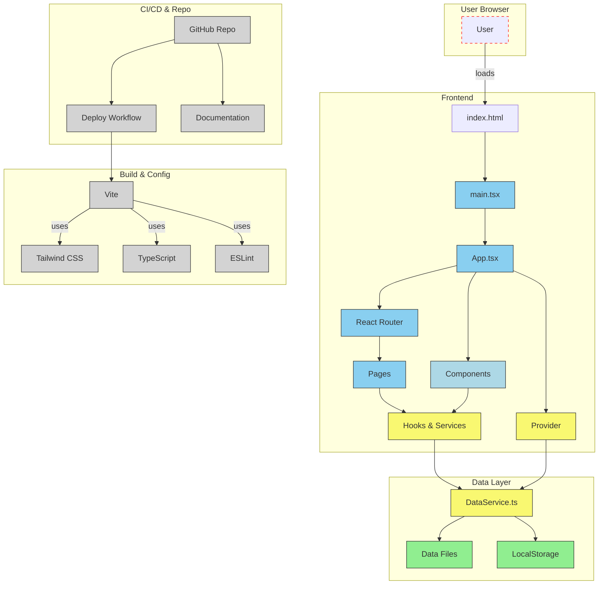

[![Contributors][contributors-shield]][contributors-url]
[![Forks][forks-shield]][forks-url]
[![Stargazers][stars-shield]][stars-url]
[![Issues][issues-shield]][issues-url]
[![GNU GPL-3.0][license-shield]][license-url]

# Deep learning in Radiotherapy products

> **Note**: The website is currently under development. We welcome contributions to verify and improve the product information accuracy.

---

## Reviewing Product Content

If you want to review or update the content of a product, here are the most relevant files and steps to follow:

### Key Files to Review
1. **`src/data/products.json`**  
   This file contains the core product data, including details like name, modality, anatomy, and certifications.  
   - **Action**: Verify the accuracy of product details and ensure consistency in tags (e.g., modality, anatomy, certifications).

2. **`src/components/product/RegulatoryInformationDetails.tsx`**  
   This component displays detailed product information on the website.  
   - **Action**: Check if the product details are rendered correctly and match the data in `products.json`.

3. **`src/config/tags.ts`**  
   This file defines the valid tags for modality, anatomy, and certifications.  
   - **Action**: Ensure that the tags used in `products.json` are consistent with the definitions here.

4. **`src/utils/validateTags.ts`**  
   This utility validates product tags against the predefined valid tags.  
   - **Action**: Confirm that the validation logic is working as expected and catches any inconsistencies.

---

## Adding New Products

When adding new products to the database, follow these guidelines to ensure data consistency and completeness:

### Product Data Structure
Each product should follow the standardized data format defined in `ProductDetails` interface. See the examples below for properly formatted product data.

### Steps to Add a New Product:

1. **Determine the Appropriate Category**
   - Products are organized by categories in `src/data/products/` directory
   - Current categories include:
     - Auto-Contouring
     - Image Enhancement
     - Image Synthesis
     - Registration
     - Reconstruction
     - Treatment Planning
     - Clinical Prediction
     - Performance Monitor

2. **Create or Update the Company-Specific File**
   - Each company has its own file in the appropriate category directory
   - If the company already exists, add your product to its file
   - If it's a new company, create a new file named `company-name.ts`
   - Example: `src/data/products/registration/varian.ts`

3. **Follow the Data Format**
   - Use the standard product format with all required fields
   - Ensure all dates follow YYYY-MM-DD format
   - Use array format for modality even for single values
   - Include regulatory information with proper structure

4. **Update the Category Index**
   - After adding the product, update the category index file to include your company products
   - Example: `src/data/products/registration/index.ts`

5. **Add the Company Logo**
   - Place the company logo in the `/public/logos/` directory
   - Use a consistent naming scheme: `company-name.png`
   - Ensure the logo is high-quality and has a transparent background

### Standardization Requirements

- **Product Names**: Should be actual product names, not just company names
- **Descriptions**: 2-3 sentences clearly explaining what the product does
- **Features**: 3-5 core features with consistent phrasing
- **Regulatory Info**: Always include CE and/or FDA status when available
- **Dates**: Always use YYYY-MM-DD format for all date fields
- **Verification**: Include lastVerified, lastUpdated, and lastRevised dates
- **URLs**: Ensure all URLs are valid and accessible

### Example Product Template

See the example product data structure below:

```typescript
{
  id: "company-productname",
  name: "Product Name",
  company: "Company Name",
  category: "Category Name",
  description: "Brief description of the product explaining what it does, its technology, and application.",
  features: [
    "Key feature 1",
    "Key feature 2",
    "Key feature 3",
    "Key feature 4"
  ],
  certification: "FDA Cleared", // or "CE Mark" or other certification
  logoUrl: "/logos/company-name.png",
  companyUrl: "https://www.company-website.com/",
  productUrl: "https://www.company-website.com/product-page",
  anatomicalLocation: ["Location1", "Location2"],
  modality: ["CT", "MRI"], // Always use array format even for single modality
  diseaseTargeted: ["Cancer", "Other diseases"],
  // ... other fields as per ProductDetails interface
  lastVerified: "2023-05-10", // When the data was last verified
  lastUpdated: "2023-04-15", // When the product data was last updated
  lastRevised: "2023-05-05"   // When the product entry was last revised
}
```

For complete examples, refer to the following template files:
- Auto-Contouring: `src/data/products/auto-contouring/limbus.ts`
- Registration: `src/data/products/registration.ts`
- Reconstruction: `src/data/products/reconstruction/accuray.ts`

---

## Development

This project is built with:

- Vite
- TypeScript
- React
- Tailwind CSS

Here is a schematic architecture of the website 


### Running Locally

The only requirement is having Node.js & npm installed - [install with nvm](https://github.com/nvm-sh/nvm#installing-and-updating)

```sh
# Clone the repository
git clone https://github.com/DLinRT-eu/website.git

# Navigate to the project directory
cd website

# Install dependencies
npm install

# Start the development server
npm run dev
```

You can also use GitHub Codespaces for development:
1. Navigate to the repository
2. Click "Code" > "Codespaces"
3. Create a new codespace to start developing

## License

This project is licensed under the GNU AGPL-3.0 License - see the LICENSE file for details. You are free to reuse and modify the code, provided you maintain the same license and provide proper attribution to the original authors.

## Team

<div align="center">
  <p><strong>Matteo Maspero</strong></p>
  <p>Project Lead - Computational Imaging Group Utrecht</p>
</div>

Feel free to contact the Project Lead in case you would like to be involved!

## How to Contribute

We welcome contributions to improve the accuracy of product information. If you notice any inaccuracies or have updates about the AI products listed, please:

1. Open an issue describing the update needed.
2. Submit a pull request with your changes.
3. Ensure proper attribution and documentation.

<!-- MARKDOWN LINKS & IMAGES -->
<!-- https://www.markdownguide.org/basic-syntax/#reference-style-links -->
[contributors-shield]: https://img.shields.io/github/contributors/DLinRT-eu/website.svg?style=for-the-badge
[contributors-url]: https://github.com/DLinRT-eu/website/graphs/contributors
[forks-shield]: https://img.shields.io/github/forks/DLinRT-eu/website.svg?style=for-the-badge
[forks-url]: https://github.com/DLinRT-eu/website/network/members
[stars-shield]: https://img.shields.io/github/stars/DLinRT-eu/website.svg?style=for-the-badge
[stars-url]: https://github.com/DLinRT-eu/website/stargazers
[issues-shield]: https://img.shields.io/github/issues/DLinRT-eu/website.svg?style=for-the-badge
[issues-url]: https://github.com/DLinRT-eu/website/issues
[license-shield]: https://img.shields.io/github/license/DLinRT-eu/website.svg?style=for-the-badge
[license-url]: https://github.com/DLinRT-eu/website/blob/master/LICENSE
