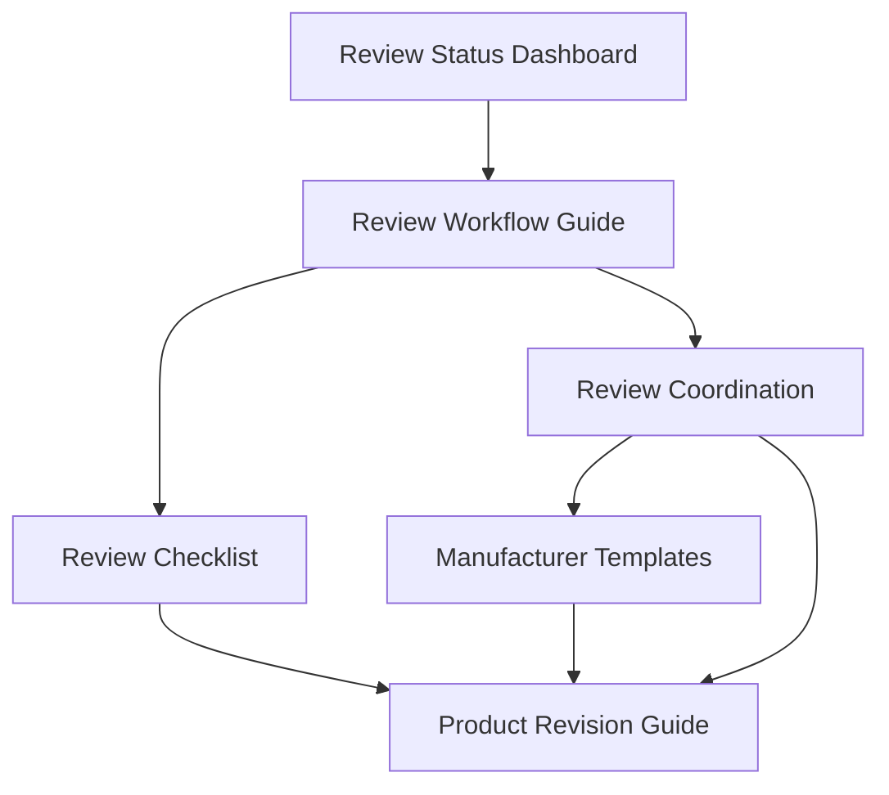

# DLinRT.eu Review Documentation Index

## Quick Links
- [Review Status Dashboard](./REVIEW_STATUS.md)
- [Review Workflow Guide](./REVIEW_WORKFLOW.md)
- [Review Checklist](./REVIEW_CHECKLIST.md)
- [Review Coordination](./REVIEW_COORDINATION.md)
- [Manufacturer Templates](./MANUFACTURER_TEMPLATES.md)
- [Product Revision Guide](./PRODUCTS_REVISION.md)

## Review Process Overview

1. **Start Here**: Check the [Review Status Dashboard](./REVIEW_STATUS.md) for current product review states
2. **Understand the Process**: Read the [Review Workflow Guide](./REVIEW_WORKFLOW.md)
3. **Coordinate**: Follow [Review Coordination](./REVIEW_COORDINATION.md) guidelines
4. **Execute Review**: Use the [Review Checklist](./REVIEW_CHECKLIST.md)
5. **Contact Manufacturers**: Use [Manufacturer Templates](./MANUFACTURER_TEMPLATES.md)
6. **Make Updates**: Follow [Product Revision Guide](./PRODUCTS_REVISION.md)

## Document Relationships

## Quick Reference

### Status Updates
Use [Review Status Dashboard](./REVIEW_STATUS.md) to:
- Track review progress
- Assign reviewers
- Document review dates
- Record verification status

### Process Execution
Follow [Review Workflow Guide](./REVIEW_WORKFLOW.md) for:
- Step-by-step review process
- Quality control measures
- Documentation requirements
- Issue resolution

### Review Tasks
Reference [Review Checklist](./REVIEW_CHECKLIST.md) for:
- Validation items
- Technical verification
- Clinical accuracy
- Regulatory compliance

### Coordination
Use [Review Coordination](./REVIEW_COORDINATION.md) for:
- Team roles
- Scheduling
- Communication protocols
- Quality metrics

### External Communication
Find in [Manufacturer Templates](./MANUFACTURER_TEMPLATES.md):
- Verification requests
- Follow-up emails
- Update confirmations
- Documentation requests

### Making Changes
Follow [Product Revision Guide](./PRODUCTS_REVISION.md) for:
- Data structure
- File organization
- Validation steps
- Submission process

## Questions or Issues?
Please open an issue in the repository or contact the review coordinator.
